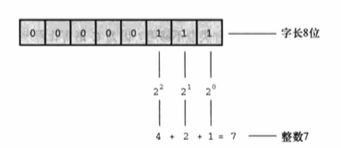
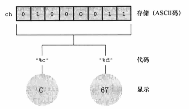

# 数据 和 C

## 示例程序

[platinum.c](platinum.c)

编译后，运行程序：

```
Are you worth your weight int platinum?
let's check it out.
Please enter your weight in pounds: 68
Your weight in platinum is worth $1685829.50.
You are easily worth that! If platinum prices drop, 
eat more to maintain your value.
```


在`Please enter your weight in pounds: `后输入体重，按下 Enter 告诉计算机已完成输入。


```
程序调整
在程序中添加一行代码：getchar();
如果程序的输出在屏幕上一闪而过，则需要调用两次 getchar() 函数：getchar();getchar();
getchar() 函数读取下一个输入字符，因此程序会等待用户输入。在这种情况下，输入 68 并按下 Enter 键，然后 scanf() 读取输入的数字，第 1 个 getchar()
读取换行符，第 2 个 getchar() 让程序暂停，等待输入。
```


### 程序中的新元素

[platinum.c](platinum.c) 包含 C 语言的一些新元素。

* 代码中使用了一种新的变量声明。float 比 int 处理更大范围的数据。float 可以储存带小数的数字。

* 程序中演示了常量的几种新写法。可以使用带小数点的数了。

* 为了打印新类型的变量，在 printf() 中使用`%f`来处理浮点值。`%.2f`中的`.2`用于精确控制输出，指定输出的浮点数只显示小数点后面两位。

* scanf() 用于读取键盘的输入。`%f`说明 scanf() 要读取用户从键盘输入的浮点数，`&weight`告诉 scanf() 把输入的值赋给名为 weight 的变量。scanf() 函
数使用`&`符号表明找到 weight 变量的地点。

* 交互性。计算机向用户询问信息，然后用户输入数字。与非交互式程序相比，交互式程序用起来更有趣，建立了人机双向通信。

## 变量和常量数据

有些数据类型在程序使用之前已经预先设定好了，在整个程序的运行过程中没有变化，这些称为**常量(constant)**。其他数据类型在程序运行期间可能会改变
或被赋值，这些称为**变量(variable)**。

## 数据类型关键字

C 通过识别一些基本的**数据类型**来区分使用不同的数据类型。如果数据是常量，编译器一般通过用户书写的形式来识别类型（如，42 是整数）。但是，对变
量而言，要在声明时指定其类型。C 语言的基本类型关键字，K&R 给出了 7 个与类型相关的关键字。C90 标准添加了 2 个关键字，C99 标准又添加了 3 个关键
字。

| 最初 K&R 给出的关键字 | C90 标准添加的关键字 | C99 标准添加的关键字 |
|:--                  |:--                 |:--                 |
| int                 | signed             | _Bool              |
| long                | void               | _Complex           |
| short               |                    | _Imaginary         |
| unsigned            |                    |                    |
| char                |                    |                    |
| float               |                    |                    |
| double              |                    |                    |

在 C 语言中，用 int 关键字来表示基本的整数类型。后 3 个关键字(long、short 和 unsigned）和 C90 新增的 signed 用于提供基本整数类型的变式，例如 
unsigned short int 和 long long int。char 关键字用于指定字母和其他字符（如，#、$、% 和 *）。另外，char 类型也可以表示较小的整数。float、double、
和 long double 表示带小数点的数。_Bool 类型表示布尔值（true 或 false），_Complex 和 _Imaginary 分别表示复数和虚数。

通过这些关键字创建的类型，按计算机的储存方式可分为两大类型：**整数类型**和**浮点数类型**。

```
位、字节和字

位、字节和字是描述计算机数据单元或存储单元的术语 。这里主要指存储单元。

最小的存储单元是位(bit)，可以储存 0 或 1（或者说，位用于设置"开"或"关"）。虽然 1 位储存的信息有限，但是计算机中位的数量十分庞大。位是计算机内
存的基本构建块。

字节(byte)是常用的计算机存储单位，对于几乎所有的机器，1 字节均为 8 位，这是字节的标准定义，至少在衡量存储单位时是这样，既然 1 位可以表示 0 
或 1，那么 8 位字节就有 256（2 的 8 次方）种可能的 0、1 的组合，通过二进制编码（仅用 0 和 1 便可表示数字），便可表示 0～255 的整数或一组字符。

字(word)是设计计算机时给定的自然存储单位，对于 8 位的微型计虎机，1 个字长只有 8 位。从那以后，个人计算机字长增至 16 位、32 位，直到目前的 64 位，
计算机的字长越大，其数据转移越快，允许的内存访问也更多。
```

### 整数和浮点数

对计算机而言，整数和浮点数的储存方式不同。

### 整数

和数学概念一样，在 C 语言中，**整数**是没有小数部分的数。计算机以二进制数字储存整数，储存整数 7 的方式如下：



### 浮点数

**浮点数**跟数学中的**实数**概念差不多。2.75、3.16E7、7.00 和 2e-8 都是浮点数。注意，在一个值后面加上一个小数点，该值就成为一个浮点值。所以，
7 是整数，7.00 是浮点数。浮点数有多种书写形式，如 e 记数法，3.16E7 表示 3.16*10^7（3.16 乘以 10 的 7 次方）。其中，10^7 = 10000000，7 被称为
10 的**指数**。

关键要理解浮点数和整数的**储存方案不同**。计算机把浮点数分成小数部分和指数部分来表示，而且分开储存这两部分。因此，虽然 7.00 和 7 在数值上相同，
但是它们的储存方式不同。

整数和浮点数两种类型的实际区别。

* 整数没有小数部分，浮点数有小数部分。

* 浮点数可以表示的范围比整数大。

* 对于一些算术运算（如，两个很大的数相减），浮点数损失的精度更多。

* 因为在任何区间内（如，1.0 到 2.0 之间）都存在无穷多个实数，所以计算机的浮点数不能表示区间内所有的值。浮点值通常只是实际值的近似值。

* 过去，浮点运算比整数运算慢。不过，现在许多 CPU 都包含浮点处理器，缩小了速度上的差距。

## C 语言基本数据类型

### int 类型

C 语言提供了许多整数类型，为什么一种类型不够用？因为 C 语言让程序员针对不同情况选择不同的类型。特别是，C 语言中的整数类型可表示不同的取值范围
和正负值。一般而言，储存一个 int 要占用一个机器字长。因此早期的 16 位 IBM PC 兼容机使用 16 位来储存一个 int 值，目前的 PC 一般是 32 位，
现在，PC 逐步向着 64 位处理器发展，自然能储存更大的整数。ISO C 规定 int 的取值范围最小为 -32768~32768。

#### 声明 int 变量

```
int erns;
int hogs, cows, goats;
```

如上，可以单独声明每个变量，也可在 int 后面列出多个变量名，变量名之间用逗号分隔。

#### 初始化变量

**初始化(initialize)**变量就是为变量赋一个初始值。初始化可直接在声明中完成。

```
int hogs = 21;
int cows = 32, goats = 14;
int dogs, cats = 94;  /* 有效，但是这种格式很糟糕 */
```

上例的最后一行，只初始化了 cats，并未初始化 dogs。这种写法很容易让人误认为 dogs 也被初始化为 94，所以不推荐使用。

声明为变量创建和标记存储空间，并为其指定初始值。

#### int 类型常量

21、32、14 和 94 都是**整型常量**或**整型字面量**。C 语言把**大多数**整型常量视为 int 类型，但是**非常大的整数除外**。

#### 打印 int 值

[print1.c](print1.c)

编译并运行该程序，输出如下：

```
Doing it right: 10 minus 2 is 8
Doing it wrong: 10 minus 16 is 1650287143
```

第二行输出中，第 1 个 %d 对应 ten 的值，但是由于没有给后两个 %d 提供任何值，所以打印出的值是内存中的任意值（在运行该程序时显示的这两个数值会
与输出示例中的数值不同，因为内存中储存的数据不同，而且编译器管理内存的位置也不同）。由于 printf() 不寻常的设计，参数数目不定，编译器也爱莫能助。

#### 八进制和十六进制

通常，C 语言都假定整型常量是十进制数。而由于 8 和 16 都是 2 的幂，而 10 不是，所以许多程序员都喜欢使用八进制和十六进制。在 C 语言中，用特定
的前缀表示使用哪种进制。`0x`或`0X`前缀表示十六进制值，`0`前缀表示八进制。例如十进制数 16，表示成十六进制是`0x10`或`0X10`，表示成八进制是`020`。

使用不同的进制是为了方便，并不会影响被储存的方式。

#### 显示八进制和十六进制

[bases.c](bases.c)

编译并运行，

```
dec = 100; octal = 144; hex = 64
dec = 100; octal = 0144; hex = 0x64
```

### 其他整数类型

C 语言提供 3 个附属关键字修饰基本整数类型：short、long 和 unsigned。

* short int(或者简写为 short)占用的存储空间可能比 int 类型少，常用于较小数值的场合以节省空间，有符号类型；

* long int 或 long 占用的存储空间可能比 int 多，适用于较大数值的场合，有符号类型；

* long long int 或 long long(C99 标准加入)占用的储存空间可能比 long 多，适用于更大数值的场合，至少占 64 位，有符号类型；

* unsigned int 或 unsigned 只用于非负值的场合，无符号整型；

* unsigned long int 或 unsigned long 或 unsigned int 或 unsigned short(C90 标准添加)，unsigned long long int 或 unsigned long long(C99 标准添加)；

* 在任何有符号类型前面添加关键字 signed，可强调使用有符号类型的意图

#### 声明其他整数类型

与 int 类型的声明相同，不是所有的编译器都能识别最后 3 条声明，最后一个例子所有的类型是 C99 标准新增的。

```
long int estine;
long johns;
short int erns;
short ribs;
unsigned int s_count;
unsigned players;
unsigned long headcount;
unsigned short yesvotes;
long long ago;
```

#### 使用多种整数类型的原因

C 语言只规定了 short 占用的存储空间不能多于 int，long 占用的存储空间不能少于 int，这样规定是为了适应不同的机器。现在，计算机普遍使用 64 位处
理器，为了储存 64 位的整数，才引入了 long long 类型。

现在，个人计算机上最常见的设置是，long long 占 64 位，long 占 32 位，short 占 16 位，int 占 16 位或 32 位（依计算机的自然字长而定）。原则上，
这 4 种类型代表 4 种不同的大小，但是在实际使用中，有些类型之间通常有重叠。

C 标准对基本数据类型只规定了允许的最小大小。

#### long 常量和 long long 常量

通常，程序代码中使用的数字（如，2345）都被储存为 int 类型。如果使用 1000000 这样的大数字，超出了 int 类型能表示的范围，编译器会将其视为 
long int 类型（假设这种类型可以表示该数字）。如果数字超出 long 可表示的最大值，编译器则将其视为 unsigned long 类型。如果还不够大，编译器则将
其视为 long long 或 unsigned long long 类型（前提是编译器能识别这些类型）。

八进制和十六进制常量被视为 int 类型，如果值太大，如上，依次使用对应的类型。

有些情况下，需要编译器以 long 类型储存一个小数字，可以在值的末尾加上`l（小写的 L）`或`L`后缀`7L`，该数字也可以是八进制和十六进制，如`020L`和`0x10L`。
long long 类型同理，加后缀`ll`或`LL`。另外，`u`或`U`后缀表示 unsigned，如 5ull、10LLU。

```
整数溢出

如果整数超出了相应类型的取值范围，会怎么样？

/* toobig.c -- 超出系统允许的最大 int 值 */
#include <stdio.h>
int main(void)
{
	int i = 2147483647;
	unsigned int j = 4294967295;

	printf("%d %d %d\n", i, i + 1, i + 2);
	printf("%d %d %d\n", j, j + 1, j + 2);

	return 0;
}

编译运行后，输出结果：
2147483647	-2147483648	-2147483647
4294967295	0	1

可以看出，当超过最大值时，变量从类型的最小值重新开始，系统并未通知用户。因此，在编程时必须自己注意这类问题。

溢出行为是未定义的行为，C 标准并未定义有符号类型的溢出规则，以上描述的溢出行为比较有代表性，但是也可能会出现其他情况。
```

#### 打印 short、long、long long 和 unsigned 类型

打印 unsigned int 类型的值，用`%u`转换说明；打印 long 类型的值，使用`%ld`转换说明。如果系统中 int 和 long 的大小相同，使用`%d`就行。但是，
这样的程序被移植到其他系统（int 和 long 类型的大小不同）中会无法正常工作。另外，虽然 C 允许使用大写或小写的常量后缀，但是在转换行说明只能
用小写。

对于 short 类型，可以使用`h`前缀。`%hd`表示以十进制显示 short 类型的整数。

[print2.c](print2.c)

编译运行后，在特定系统中输入如下（输出的结果可能不同）：

```
un = 3000000000 and not -1294967296
end = 200 and 200
big = 65537 and not 1
verybig = 12345678908642 and not 1942899938
```

该例说明，使用错误的转换说明会得到意想不到的结果。

### 使用字符：char 类型

char 类型用于储存字符（如，字线或标点符号），但是从技术层面看，char 是**整数类型**。因为 char 类型实际上储存的是整数而不是字符。计算机使用
数字编码来处理字符，即用特定的整数表示特定的字符。美国最常用的编码是 ASCII 编码，在 ASCII 码中，整数 65 表示大写字母 A。因此，储存字母 A 
实际上储存的是整数 65。

#### 声明 char 类型变量

```
char response;
char itable, latan;
```

#### 字符常量和初始化

如果要把一个字符常量初始化为字母 A，不必背下 ASCII 码，用计算机很容易做到。

```
char grade = 'A';
```

在 C 语言中，用单引号括起来的单个字符被称为**字符常量(character constant)**。编译器一发现`'A'`，就会将其转换成相应的代码值。**单引号必不可少**。

```
char broiled;	/* 声明一个 char 类型的变量 */
broiled = 'T';	/* 为其赋值，正确 */
broiled = T;	/* 错误！此时 T 是一个变量 */
broiled = "T";	/* 错误！此时"T"是一个字符串 */
```

实际上，字符是以数值形式储存的，所以可以使用数字代码值来赋值：

```
char grade = 65; /* 对于 ASCII，这样做没问题，但这是一种不好的编程习惯 */
```

虽然 65 是 int 类型，但是它在 char 类型能表示的范围内，所以将其赋值给 grade 没问题。由于 65 是字母 A 对应的 ASCII 码，因此本例是把 A 赋给
grade。**注意，能这样做的前提是系统使用 ASCII 码**。用`'A'`代替 65 才是较为妥当的做法，这样在任何系统中都不会出问题。因此，最好使用字符常
量，而不是数字代码值。

```
奇怪的是，C 语言将字符常量视为 int 类型而非 char 类型。例如，在 int 为 32 位，char 为 8 位的 ASCII 系统中，有下面的代码：

char grade = 'B';

本来'B'对应的数值 66 储存在 32 位的存储单元中，现在却可以储存在 8 位的存储单元中(grade)。利用字符常量的这种特性，可以定义一个字符常量'FATE'，
即把 4 个独立的 8 位 ASCII 码储存在一个 32 位存储单元中。如果把这样的字符常量赋给 char 类型变量 grade，只有最后 8 位有效。因此，grade 的值
是'E'。
```

#### 非打印字符

单引号只适用于字符、数字和标点符号，浏览 ASCII 会发现，有些 ASCII 字符打印不出来。C 语言提供了 3 种方法表示这些字符。

1.	使用 ASCII 码。例如，蜂鸣字符的 ASCII 值是 7，因此可以这样写：`char beep = 7;`；

2.	使用特殊的符号序列表示一些特殊字符。这些符号序列叫做**转义序列(escape sequence)**。

| 转义序列 | 含义 |
|:--       | :--  |
| \a       | 警报(ANSI C) |
| \b       | 退格 |
| \f       | 换页 |
| \n       | 换行 |
| \r       | 回车 |
| \t       | 水平制表符 |
| \v       | 垂直制表符 |
| \\\      | 反斜杠(\\)  |
| \'       | 单引号 |
| \"       | 双引号 |
| \?       | 问号 |
| \0oo     | 八进制值(oo 必须是有效的八进制数，即每个 o 可表示 0～7 中的一个数) |
| \xhh     | 十六进制值(hh 必须是有效的十六进制数，即每个 h 可表示 0～f 中的一个数) |
	
	

	从 C90 开始，不仅可以用十进制、八进制形式表示字符常量，C 语言还提供了第 3 种选择——用十六进制形式表示字符常量，即反斜杠后面跟一个 x 或 X，
	再加上 1～3 位十六进制数字。

	使用 ASCII 码时，注意数字和数字字符的区别。例如，字符 4 对应的 ASCII 码是 52，'4'表示字符 4，而不是数值 4。

#### 打印字符

printf() 用`%c`指明待打印的字符。

[charcode.c](charcode.c)

printf() 中的转换说明决定了数据的显式方式，而不是数据的储存方式。



#### 有符号还是无符号

不同的编译器实现的 char 类型不同，有的实现为有符号类型，有的实现为无符号类型。根据 C90 标准，C 语言允许在关键字 char 前面使用 signed 或 
unsigned，这在用 char 类型处理小整数时很有用。如果只用 char 处理字符， char 前面无需使用任何修饰符。

### _Bool 类型

C99 标准添加了 _Bool 类型， 用于表示布尔值，即逻辑值 true 和 false。因为 C 语言用值 1 表示 true，值 0 表示 false，所以 _Bool 类型实际上也
是一种整数类型。但原则上它仅占 1 位存储空间。

### 可移值类型：stdint.h 和 inttypes.h

C 语言提供了许多有用的整数类型。但是，某些类型名在不同系统中的功能不一样。C99 新增了两个头文件 stdint.h 和 inttypes.h，以确保 C 语言的类型
在各系统中的功能相同。

C 语言为现有类型创建了更多的类型名。这些新的类名定义在 stdint.h 头文件中。例如，int32_t 表示 32 位的有符号整数类型，使用 int32_t 类型编写
程序，并包含 stdint.h 头文件时，编译器会把 int 或 long 替换成与当前系统匹配的类型。

以上讨论的类型别名是**精确宽度整数类型(exact-width integer type)**的示例。int32_t 表示整数类型的宽度正好是 32 位。但是，计算机的底层系统可
能不支持。因此，精确宽度整数类型是可选项。

如果系统不支持精确宽度整数类型，C99 和 C11 提供了第 2 类别名集合。一些类型名保证所表示的类型一定是至少有指定宽度的最小整数类型。这组类型
集合被称为**最小宽度类型(minimum width type)**。例如，int_least8_t 是可容纳 8 位有符号整数值的类型中宽度最小的类型的一个别名。

当然，一些程序员更关心速度而非空间。为此 C99 和 C11 定义了一组可使计算达到最快的类型集合。这组类型集合被称为**最快最小宽度类型
(fastest minimum width type)**。例如，int_fast8_t 被定义为系统中对 8 位有符号值而言运算最快的整数类型的别名。

另外，有些程序员需要系统的最大整数类型。为此，C99 定义了最大的有符号整数类型 intmax_t，可储存任何有效的有符号整数值。类似地，uintmax_t 表
示最大的无符号整数类型。顺带一提，这些类型可能比 long long 和 unsigned long 类型更大，因为 C 编译器除了实现标准规定的类型以外，还可利用 C 
语言实现其他类型。

C99 和 C11 不仅提供可移植的类型名，还提供相应的输入和输出。例如，printf() 打印特定类型时要求与相应的转换说明匹配。C 标准提供了一些字符串宏
来显示可移植类型，在 inttypes.h 头文件中。

[altnames.c](altnames.c)

在 C 语言中，可以把多个连续的字符串组合成一个字符串。

### float、double 和 long double

各种整数类型对大多软件开发项目而言够用了。然而，面向金融和数学的程序经常使用**浮点数**。C 语言中的浮点类型有 float、double 和 long double 类
型。浮点类型能表示包括小数在内更大范围的数。浮点数的表示灰似于**科学记数法（即用小数乘以 10 的幂来表示数字）**。

记数法示例：

| 数字 | 科学计数法 | 指数记数法 |
|:--   |:--         |:--         |
| 1000000000 | 1.0*10^9 | 1.0e9 |
| 123000 | 1.23*10^5 | 1.23e5 |
| 322.56 | 3.2256*10^2 | 3.2256e2 |
| 0.000056 | 5.6*10^(-5) | 5.6e-5 |
C 标准规定，float 类型必须至少能表示 6 位有效数字，且取值范围至少是 10^(-37)~10^(+37)。通常，系统储存一个浮点数要占用 32 位，其中 8 位用于表
示指数的值和符号，剩下 24 位用于表示非指数部分（也叫做**尾数**或**有效数**）及其符号。

C 语方提供的另一种浮点类型是 double。double 类型和 float 类型的最小取值范围相同，但至少必须能表示 10 位有效数字。一般情况下，double 占用 64 位
而不是 32 位。一些系统将多出的 32 位全部用来表示非指数部分，另一些系统把其中的一些位分配给指数部分。

C 语言的第 3 种浮点类型是 long double，以满足比 double 类型更高的精度要求。不过，C 只保证 long double 类型至少与 double 类型的精度相同。

#### 声明浮点型变量

```
float noah, jonah;
double trouble;
float planck = 6.63e-34;
long double gnp;
```

#### 浮点型常量

浮点型常量的基本形式是：有符号的数字（包括小数点），后面紧跟 e 或 E，最后是一个有符号数表示 10 的指数。下面是两个有效的浮点型常量：

```
-1.56E+12
2.87e-3
```

正号可以省略。可以没有小数点（如，2E5）或指数部分（如，19.28），但是不能同时省略两者。可以省略小数部分（如，3.E16）或整数部分（如，.45E-6），
但是不能同时省略两者。

在浮点数后面加上 f 或 F 后缀，编译器会将浮点数常量看作 float 类型，如 2.3f。使用 l 或 L 后缀使得数字成为 long double 类型，如 54.31L。没有后
缀的常量是 double 类型。

#### 打印浮点值

[showf_pt.c](showf_pt.c)

#### 浮点值的上溢和下溢

假设系统的最大 float 类型值是 3.4E38。

```
float toobig = 3.4E38 * 100.0f;
printf("%e\n", toobig);
```

这是一个**上溢(overflow)**示例。当计算导致数字超过当前类型能表达的范围时，就会发生上溢。上例的值为`inf`或`infinity`。

```
// TODO: 下溢、NaN
```

### 复数和虚数类型

### 其他类型

### 类型大小

[typesize.c](typesize.c)

sizeof 是 C 语言的内置运算符，以字节为单位给出指定类型的大小。

## 使用数据类型

合理选择所需变量及其类型。

## 参数和陷阱

C 语言通过函数原型机制检查函数调用时参数的个数和类型是否正确。但是，该机制对 printf() 和 scanf() 不起作用，因为这两个函数的参数个数可变。

[badcount.c](badcount.c)

上例在参数匹配上有问题。在不同的平台下，缺少参数或参数类型不匹配导致的结果不同。

## 转义序列示例

[escape.c](escape.c)

### 程序运行情况

```
Enter your desired monthly salary: $4000.00
Gee!    $4000.00 a month is $48000.00 a year.
```

### 刷新输出

最初，printf() 语句把输出发送到一个叫作**缓冲区(buffer)**的中间存储区域，然后缓冲区中的内容再不断被发送到屏幕上。C 标准明确规定了何时把缓冲区
中的内容发送到屏幕：当缓冲区满、遇到换行字符或需要输入的时候（从缓冲区把数据发送到屏幕或文件被称为**刷新缓冲区**）。

旧式编译器遇到 scanf() 也不会强行刷新缓冲区，程序会停在那里不显示任何提示内容，等待用户输入数据。这种情况下，可以用换行字符刷新缓冲区。

```
printf("Enter your desired monthly salary:\n");
scanf("%f", &salary);
```

或者使用 fflush() 函数。
