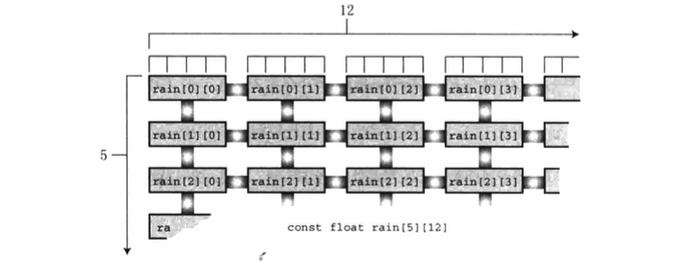
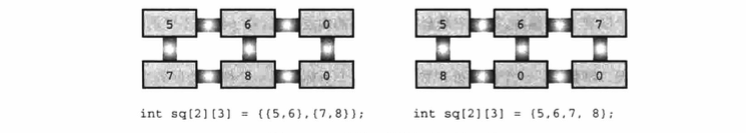

# 数组和指针

## 数组

`数组`由数据类型相同的一系列元素组成。需要使用数组时，通过声明数组告诉编译器数组中内含多少元素和这些元素的类型。编译器根据这些信息正确地创建
数组。C 把数组看作是`派生类型`，因为数组是建立在其他类型的基础上。也就是说，无法简单地声明一个数组。在声明数组时必须说明其元素的类型，如 int
类型的数组、float 类型的数组，或其他类型的数组。

一些数组声明：

```
int main()
{
    float candy[365];  /* 内含 365 个 float 类型的元素的数组 */
    char code[12];     /* 内含 12 个 char 类型元素的数组 */
    int states[50];    /* 内含 50 个 int 类型元素的数组 */
}
```

方括号`[]`表明 candy、code 和 states 都是数组，方括号中的数字表明数组中的元素个数。

### 初始化数组

只储存单个值的变量有时也称为**标量变量(scalar variable)**。C 使用新的语法来初始化数组。

```
int main()
{
    int power[8] = { 1, 2, 4, 6, 8, 16, 32, 64 };  /* ANSI C 开始支持这种初始化 */
}
```

如上，用以逗号分隔的值列表（用花括号括起来）来初始化数组，各值之间用逗号分隔。在逗号和值之间可以使用空格，以下是一个小程序，[day_mon1.c](day_mon1.c)。
该例使用了符号常量 MONTHS 表示数组大小，这是推荐且常用的做法。

**注意：使用 const 声明数组**。有时候需要把数组设置为只读。这样，程序只能从数组中检索值，不能把新值写入数组。要创建只读数组，应该用 const
声明和初始化数组。上例中的初始化应该改成：`const int days[MONTHS] = { 31, 28, 31, 30, 31, 30, 31, 31, 30, 31, 30, 31 };`

如果初始化数组失败了怎么办？[no_data.c](no_data.c)，系统不同，该例的输出可能不同，使用数组前必须先初始化它。

假如初始化列表中的项数不一致，如[somedata.c](somedata.c)，可见，当初始化列表中的值少于数组元素个数时，编译器会把剩余的元素都初始化为 0。
如果初始化列表的项数多于数组元素个数，编译器会视为错误。其实初始化时可以省略方括号中的数字，让编译器自动匹配数组大小和初始化列表中的项数，[day_mon2.c](day_mon2.c)，此时需要注意以下两点：

*	如果初始化数组时省略方括号中的数字，编译器会根据初始化列表中的项数来确定数组的大小；

*	注意 for 循环中的测试条件。由于人工计算容易出错，所以让计算机来计算数组的大小。sizeof 运算符给出它的运算对象的大小（以字节为单位）；


### 指定初始化器(C99)

C99 增加了一个新特性，`指定初始化器(designated initializer)`。利用该特性可以初始化指定的数组元素。例如，只初始化数组中的最后一个元素。对于传统
的 C 初始化语法，必须初始化最后一个元素之前的所有元素，才能初始化它：

```
int arr[6] = {0, 0, 0, 0, 0, 212};  // 传统的语法
```

而 C99 规定，可以在初始化列表中使用带方括号的下标指明待初始化的元素：

```
int arr[6] = {[5] = 212};  // 把 arr[5] 初始化为 212
```

对于未初始化的元素都会被设置为 0，[designate.c](designate.c)。以上代码揭示了指定初始化器的两个重要特性：

1.	如果指定初始化器后面有更多的值，如该例中的`[4] = 31, 30, 31, `，那么后面这些值将被用于初始化指定元素后面的元素。也就是说，在`day[4]`初始化
	为 31 后，`day[5]`和`day[6]`将分别被初始化为 30 和 31；

2.	如果再次初始化指定的元素，那么最后的初始化将会取代之前的初始化，如该例中的`day[1]`初始化为 28，但是后面又被指定初始化`[1] = 29`初始化为 29；

如果未指定元素大小会怎样？

```
int stuff[] = {1, [6] = 23};		// 会发生什么？
int staff[] = {1, [6] = 4, 9, 10};  // 会发生什么？
```

编译器会把数组的大小设置为足够装得下初始化的值。所以，stuff 有 7 个元素，而 staff 有 9 个元素。

### 给数组元素赋值

声明数组后，可以借助下标（或索引）给数组元素赋值，[assignment.c](assignment.c)。

注意，这段代码中使用循环给数组的元素依次赋值。**C 不允许把数组作为一个单元赋给另一个数组**，除初始化以外也不允许使用花括号列表的形式赋值。

以下是一些错误的赋值形式，[invalid_assignment.c](invalid_assignment.c)。

### 数组边界

在使用数组时，要防止数组下标起出边界。也就是说，必须确保下标是有效的值。例如：`int doofi[20]`，在使用该数组时，要确保程序中使用的数组下标在
0 ~ 19 的范围内，以下程序错误地使用了下标，[bounds.c](bounds.c)。编译器不会检查数组下标是否使用得当。在 C 标准中，使用越界下标的结果是未定义
的。这意味着程序看上去是可以运行的，但是运行结果很奇怪，或者异常中止，不同的编译器运行该程序的结果可能不同。

C 语言为何会允许这种麻烦事发生？这要归功于 C 信任程序员的原则。不检查边界，C 程序可以运行更快。编译器没必要捕获所有的下标错误，因为在程序运行
之前，数组的下标值可能尚未确定。因此，为了安全起见，编译器必须在运行时添加额外代码检查数组的每个下标值，这会降低程序的运行速度。C 相信程序员能
编写正确的代码，这样的程序运行速度更快。

### 指定数组的大小

在 C99 标准之前，声明数组时只能在方括号中使用`整型常量表达式`。所谓整型常量表达式，是由整型常量构成的表达式。`sizeof`表达式被视为整型常量，
但`const`值不是。另外，表达式的值必须大于 0。

C99 标准允许声明`变长数组(variable-length array)`，或简称为 VLA（C11 放弃了这一创新举措，把 VLA 设定为可选，而不是语言必备特性）。变长数组如下：

```
int n = 5;
float arr[n];
```

## 多维数组

```
float rain[5][12];  // 内含 5 个数组元素的数组，每个数组元素内含 12 个 float 类型的元素
```

如上所示，是数组的数组。`主数组(master array)`有 5 个元素，每个元素是内含 12 个 float 类型元素的数组。这样的数组是按顺序储存的，从第 1 个内含
12 个元素的数组开始，然后是第 2 个内含 12 个元素的数组，依此类推。理解该声明的一种方法是，先查看中间部分（粗体部分）：
*float **rain[5]**[12]; // rain 是一个内含 5 个元素的数组*。这说明数组 rain 有 5 个元素，至于每个元素的情况，要查看声明的其余部分（粗体部分）：
***float*** *rain[5]**[12]**;  // 一个内含 12 个 float 类型元素的数组*。说明每个元素的类型是 float[12]，也就是说，rain 的每个元素本身都是一个内
含 12 个 float 类型值的数组。

在计算机内部，这样的数组是按顺序储存的，如图。



以下是一个演示程序，[rain.c](rain.c)。

### 初始化二维数组

初始化二维数组是建立在初始化一维数组的基础上。首先，初始化一维数组如下：

```
sometype arr[5] = {val1, val2, val3, val4, val5};
```

这里 val1、val2 等表示 sometype 类型的值。例如，sometype 是 int，那么 val1 可能是 7；如果 sometype 是 double，那么 val1 可能是 11.34，诸如此类。
但是 rain 是一个内含 5 个元素的数组，每个元素又是内含 12 个 float 类型元素的数组。所以，对 rain 而言，val1 应该包含 12 个值，用于初始化内含 12
个 float 类型的一维数组，如下所示：

```
{4.3, 4.3, 4.3, 3.0, 2.0, 1.2, 0.2, 0.2, 0.4, 2.4, 3.5, 6.6}
```

也就是说，如果 sometype 是一个内含 12 个元素类型元素的数组，那么 val1 就是一个由 12 个 double 类型值构成的数值列表。因此，为了初始化二维数组
rain，要用逗号分隔 5 个这样的数值列表：

```
const float rain[YEARS][MONTHS] =
{
    {4.3, 4.3, 4.3, 3.0, 2.0, 1.2, 0.2, 0.2, 0.4, 2.4, 3.5, 6.6,},
    {8.5, 8.2, 1.2, 1.6, 2.4, 0.0, 5.2, 0.9, 0.3, 0.9, 1.4, 7.3,},
    {9.1, 8.5, 6.7, 4.3, 2.1, 0.8, 0.2, 0.2, 1.1, 2.3, 6.1, 8.4,},
    {7.2, 9.9, 8.4, 3.3, 1.2, 0.8, 0.4, 0.0, 0.6, 1.7, 4.3, 6.2,},
    {7.6, 5.6, 3.8, 2.8, 3.8, 0.2, 0.0, 0.0, 0.0, 1.3, 2.6, 5.2,},
};
```

这个初始化使用了 5 个数值列表，每个数值列表都用花括号括起来。如果第 1 个列表中只有 10 个数，则只会初始化数组第 1 行的前 10 个元素，而最后两个
元素将被默认初始化为 0。如果某列表中的数值个数超出了数组每行的元素个数，则会出错。但这并不会影响其他行的初始化。

初始化时也可省略内部的花括号，只保留最外面的一对花括号。只要保证初始化的数值个数正确，初始化的效果与上面相同。但是如果初始化的数值不够，则按照
先后顺序逐行初始化，直到用完所有的值。后面没有初始化的元素被统一初始化为 0。如例[init_multi_array.c](init_multi_array.c)，下图演示了该例初始化
的方法效果。



### 其他多维数组

二维数组的相关内容都适用于三维数组或更多维的数组。可以这样声明一个三维数组：

```
int box[10][20][30];
```

## 指针和数组

指针提供一种以符号形式使用地址的方法。因为计算机的硬件指令非常依赖地址，指针在某种程序上把程序员想要传达的指令以更接近机器的方式表达。因此，
使用指针的程序更有效率。尤其是，指针能有效地处理数组。数组表达法其实是在变相地使用指针。

一个变相使用指针的例子：数组名是数组首元素的地址。也就是说，如果 flizny 是一个数组，下面语句成立：

```
filzny = &flizny[0];  // 数组名是该数组首元素的地址
```

flizny 和 &flizny[0] 都表示数组首元素的内存地址（& 是地址运算符）。两者都是**常量**，在程序运行过程中，不会改变。但是，可以把它们赋值给指针变量，
然后可以修改指针变量的值，如程序[pnt_add.c](pnt_add.c)。

在系统中，地址按字节编址，short 类型占用 2 字节，double 类型占用 8 字节。在 C 中，指针加 1 指的是增加一个`存储单元`。对数组而言，这意味着加 1
后的地址是下一个`元素`的地址，而不是下一个节字的地址。这也是必须声明指针所指向对象类型的原因之一。只知道地址不够，因为计算机要知道储存对象需要
多少字节（即使指针指向的是标题变量，也要知道变量的类型，否则`*pt`就无法正确地取回地址上的值）。

例如：

```
short *pti;
printf("%p %p\n", pti, pti + 1);
```

对于 pti 来说，类型是 short，所以每次增加 1，其值递增 2 字节。

现在可以更清楚地定义指向 int 的指针、指向 float 的指针，以及指向其他数据对象的指针。

*	指针的值是它所指向对象的地址。地址的表示方式依赖于计算机内部的硬件。许多计算机都是`按字节编址`，意思是内存中的每个字节都按顺序编号。这里，
	一个较大对象的地址（如 double 类型的变量）通常是该对象第一个字节的地址；

*	在指针前面使用`*`运算符可以得到该指针所指向对象的值；

*	指针加 1，指针的值递增它所指向类型的大小（以字节为单位）；

以下等式体现了 C 语言的灵活性：

```
dates + 2 == &date[2]     // 相同的地址
*(dates + 2) == dates[2]  // 相同的值
```

以上关系表明了数组和指针的关系十分密切，可以使用指针标识数组的元素和获得元素的值。从本质上看，同一个对象有两种表示法。实际上，C 语言标准在
描述数组表示法时确实借助了指针。也就是说，定义`ar[n]`的意思是`*(ar + n)`。可以认为`*(ar + n)`的意思是**到内存的 ar 位置，然后移动 n 个单元，
检索储存在那里的值**。

现在来看一下程序[day_mon3.c](day_mon3.c)

指针表示法和数组表示法是两种等效的方法，可以用指针表示数组，也可以用数组表示指针。

## 函数、数组和指针

假设要编写一个处理数组的函数，该函数返回数组中所有元素之和，待处理的名为 marbles 的 int 类型数组。调用该函数：

```
total = sum(marbles);  // 可能的函数调用
```

那么，该函数的原型是什么？记住，数组名是该数组首元素的地址，所以实际参数 marbles 是一个储存 int 类型值的地址，应把它赋给一个指针形式参数，
即该形参是一个指向 int 的指针：

```
int sum(int *ar);  // 对应的函数原型
```

sum() 从该参数获得了该数组首元素的地址，知道要在该位置找出一个整数。注意，该参数并未包含数组元素个数的信息。有两种方法让函数获得这一信息。

1.	第一种方法，在函数代码中写上固定的数组大小：

	```
	int sum(int *ar)	// 相应的函数定义
	{
		int i;
		int total = 0;

		for (i = 0; i < 10; i ++) {		// 假设数组有 10 个元素
			total += ar[i];				// ar[i] 与 *(ar + i) 相同
		}

		return total;
	}
	```

	既然能使用指针表示数组名，也可以用数组名表示指针。该函数定义有限制，只能计算 10 个类型的元素。

2.	另一种比较灵活的方法，把数组大小作为第 2 个参数：

	```
	int sum(int *ar, int n)  // 更通用的方法
	{
		int i;
		int total = 0;

		for (i = 0; i < n; i ++) {	// 使用 n 个元素
			total += ar[i];			// ar[i] 和 *(ar + i) 相同
		}

		return total;
	}
	```

	这里，第 1 个形参告诉函数该数组的地址和数据类型，第 2 个形参告诉函数该数组中元素的个数。另外，关于函数的形参，还有一点要注意。**只有在
	函数原型或函数定义头中，才可以用`int ar[]`代替`int *ar`：`int sum(int ar[], int n);`。`int *ar`形式和`int ar[]`形式都表示 ar 是一个指向
	int 的指针。但是，`int ar[]`只能用于声明形式参数。第 2 种形式`(int ar[])`提醒读者指针 ar 指向的不仅仅是一个 int 类型值，还是一个 int 类
	型数组的元素。


**注意 声明数组形参**：因为数组名是该数组首元素的地址，作为实际参数的数组名要求形式参数是一个与之匹配的指针。只有在这种情况下，C 才会把`int ar[]`
和`int *ar`解释成一样。也就是说，ar 是指向 int 的指针。由于函数原型可以省略参数名，所以以下 4 种原型是等价的：

```
int sum(int *ar);
int sum(int *);
int sum(int ar[]);
int sum(int []);
```

**但是，在函数定义中不能省略参数名**。下面两种形式的函数定义等价：

```
int sum(int *ar, int n)
{
	// do something
}

int sum(int ar[], int n)
{
	// do something
}
```

下面是一个演示程序[sum_arr1.c](sum_arr1.c)。marbles 的大小是 40 字节。这没问题，因为 marbles 内含 10 个 int 类型的值，每个值占 4 字节；
但是 ar 才 8 字节，这是因为 ar 并不是数组本身，它是一个指向 marbles 数组首元素的指针。指针变量大小与系统有关。

### 使用指针形参

函数要处理数组必须知道何时开始、何时结束。sum() 函数使用一个指针形参标识数组的开始，用一个整数形参表明待处理数组的元素个数（指针形参也表
明了数组中的数据类型）。但这并不是给函数传递必备信息的唯一方法。还有一种方法是传递两个指针，第 1 个指针指明数组的开始处，第 2 个指针指明
数组的结束处，如[sum_arr2.c](sum_arr2.c)。

前面程序指针开始指向 marbles 数组首元素，表达式`start++`递增指针变量 start，使其指向数组的下一个元素。因为 start 是指向 int 的指针，start 递
增 1 相当于其值递增 int 类型的大小。**注意，sump() 函数用另一种方法结束循环。sump() 函数使用第 2 个指针来结束循环，end 指向的位置实际上在数组
最后一个元素的后面。C 保证在给数组分配空间时，指向数组后面第一个位置的指针仍是有效的指针。**顺带一提，虽然 C 保证了`marbles + SIZE`有效，但是
对`marbles[SIZE]`（即储存在该位置上的值）未作任何保证，所以程序不能访问该位置。

下面程序演示了指针运算中优先级的情况[order.c](order.c)。

### 指针表示法和数组表示法

从以上分析可知，处理数组的函数实际上用指针作为参数。指针表示法（尤其与递增运算符一起使用时）更接近机器语言，因此一些编译器在编译时能生成效率
更高的代码。

## 指针操作

以下是指针变量的 8 种基本操作，除了这些操作，还可以使用关系运算来比较指针：

1.	赋值：可以把地址赋给指针。例如，用数组名、带地址运算符(&)的变量名、另一个指针进行赋值。要注意的是，地址应该和指针类型兼容，也就是不能把
	double 类型的地址赋给指向 int 的指针，至少要避免不明智的类型转换。C99/C11 已经不允许这样做。
2.	解引用：`*`运算符给出指针指向地址上储存的值。
3.	取址：和所有变量一样，指针变量也有自己的地址和值。对指针而言，& 运算符给出指针本身的地址。
4.	指针与整数相加：可以使用 + 运算符把指针与整数相加，或整数与指针相加。无论哪种情况，整数都会和指针所指向类型的大小（以字节为单位）相乘，然
	后把结果与初始地址相加。如果相加的结果超出了初始指针指向的数组范围，计算结果则是未定义的。除非正好超过数组末尾第一个位置，C 保证该指针有效。
5.	递增指针：递增指向数组元素的指针可以让该指针移动至数组的下一个元素。
6.	指针减去一个整数：可以使用 - 运算符从一个指针中减去一个整数。指针必须是第 1 个运算对象，整数是第 2 个运算对象。该整数将乘以指针指向类型的
	大小（以字节为单位），然后用初始地址减去乘积。如果相减的结果超出了初始指针所指向数组的范围，计算结果则是未定义的。除非正好超过数组末尾第
	一个位置，C 保证该指针有效。
7.	递减指针：与递增指针相反。
8.	指针求差：可以计算两个指针的差值。通常，求差的两个指针分别指向同一个数组的不同元素，通过计算求出两个元素之间的距离。差值的单位与数组类型的
	单位相同。只要两个指针都指向相同的数组（或者其中一个指针指向数组后面的第 1 个地址），C 都能保证相减运算有效。如果指向两个不同数组的指针进
	行求差运算可能会得出一个值，或者导致运行时错误。
9.	比较：使用关系运算符可以比较两个指针的值，前提是两个指针都指向相同类型的对象。

在递增或递减指针时还要注意一些问题。编译器不会检查指针是否仍指向数组元素。C 只能保证指向数组任意元素的指针和指向数组后面第 1 个位置的指针有效。
但是，如果递增或递减一个指针后超出了这个范围，则是未定义的。另外，可以解引用指向数组任意元素的指针。但是，即使指针指向数组后面一个位置是有效的，
也能解引用这样的越界指针。

**注意：**一定要牢记一点，千万不要解引用未初始化的指针。例如：

```
int *pt;  // 未初始化的指针
*pt = 5;  // 严重的错误
```

为什么不能这样？第 2 行的意思是把 5 储存在 pt 指向的位置。但是 pt 未被初始化，其值是一个随机值，所以不知道 5 将储存在何处。这可能不会出什么错，
也可能会擦写数据或代码，或者导致程序崩溃。切记：创建一个指针时，系统只分配了储存指针本身的内存，并未分配储存数据的内存。因此，在使用指针之前，
必须先用已分配的地址初始化它。

## 保护数组中的数据

编写一个处理基本类型（如，int）的函数时，要选择是传递 int 类型的值还是传递指向 int 的指针。通常都是直接传递数值，只有程序需要在函数中改变该数
值时，才会传递指针。对于数组别无选择，必须传递指针，因为这样做效率高。

### 对形式参数使用 const

在 K&R C 的年代，避免类似错误的唯一方法是提高警惕。ANSI C 提供了一种预防手段。如果意图不是修改数组中的数据内容，那么在函数原型和函数定义中声明
形式参数时应使用关键字 const。例如：

```
int sum(const int ar[], int n);  /* 函数原型 */

int sum(const int ar[], int n)
{
    int i;
    int total = 0;
    
    for (i = 0; i < n; i ++) {
        total += ar[i];
    }
    
    return total;
}
```

以上代码中的 const 告诉编译器，该函数不能修改 ar 指向的数组中的内容。如果在函数中不小心使用类似`ar[i] ++`的表达式，编译器会捕获这个错误，并生
成一条错误信息。

使用 const 不是要求原数组是常量，而是该函数在处理数组时将其视为常量，不可更改，示例[arf.c](arf.c)。

### const 的其他内容

虽然用`#define`指令可以创建类似功能的符号常量，但是 const 的用法更加灵活。可以创建 const 数组、const 指针和指向 const 的指针。

```
#define MONTH 12
...
const int days[MONTHS] = {31, 28, 31, 30, 31, 30, 31, 31, 30, 31, 30, 31};
days[9] = 44;	// 编译错误


double rates[5] = {88.99, 100.12, 59.45, 183.11, 340.5};
const double *pd = rates;	// 指向 const 的不能用于改变值，pd 指向的 double 的值声明为 const，这表明不能使用 pd 来更改它所指向的值
*pd = 39.89;				// 不允许
pd[2] = 222.22;				// 不允许
rates[0] = 99.99;			// 允许，因为 rates 未被 const 限定
pd ++;						// 让 pd 指向 rate[1]，没问题


double rates[5] = {88.99, 100.12, 59.45, 183.11, 340.5};
const double locked[4] = {0.08, 0.075, 0.0725, 0.07};
const double *pd = rates;	// 有效，把 const 数据或非 const 数据的地址初始化为指向 const 的指针或为其赋值是合法的
pc = locked;				// 有效
pc = &rates[3];				// 有效
double *pnc = rates;		// 有效，把非 const 数据的地址赋给普通指针
pnc = locked;				// 无效，不能把 const 数据的地址赋给普通指针，这个规则非常合理。否则，通过指针就能改变 const 数组中的数据
pnc = &rates[3];			// 有效


void show_array(const double *ar, int n);	// 指向 const 的指针通常用于函数形参中，表明该函数不会使用指针改变数据。show_array() 可以接受普通数
											// 组名和 const 数组名作为参数，因为这两种参数都可以用来初始化指向 const 的指针
show_array(rates, 5);						// 有效
show_array(locked, 5);						// 有效


void mult_array(double ar[], int n, double mult);
mult_array(rates, 5, 1.2);					// 有效
mult_array(locked, 4, 1.2);					// 不要这样做，C 标准规定，使用非 const 标识符修改 const 数据导致的结果是未定义的
```

const 还有其他的用法。例如，可以声明并初始化一个不能指向别处的指针，关键是 const 的位置：

```
double rates[5] = {88.99, 100.12, 59.45, 183.11, 340.5};
double * const pd = rates;  // pd 指向数组的开始

pd = &rate[2];  			// 不允许，因为该指针不能指向别处
*pd = 92.99;    			// 没问题 -- 更改 rates[0] 的值
```

可以用以上指针修改它所指向的值，但是它只能指向初始化时设置的地址。

最后，在创建指针时还可以使用 const 再次，该指针既不能更改它所指向的地址，也不能修改指向地址上的值。

```
double rates[5] = {88.99, 100.12, 59.45, 183.11, 340.5};
const double * const pc = rates;

pc = &rates[2];  // 不允许
*pc = 92.99;     // 不允许
```

## 指针和多维数组

假设有下面的声明：`int zippo[4][2];  /* 内含 int 数组的数组 */`。

然后数组名 zippo 是该数组首元素的地址。zippo 的首元素是一个内含两个 int 值的数组，
所以 zippo 是这个内含两个 int 值的数组的地址。

* 因为`zippo`是数组首元素的地址，所以`zippo`的值和`&zippo[0]`的值相同。
  而`zippo[0]`本身是一个内含两个整数的数组，所以`zippo[0]`的值和它首元素（一个整数）的地址（即`&zippo[0][0]`的值）相同。
  简而言之，`zippo[0]`是一个占用一个 int 大小对象的地址，而`zippo`是一个占用两个 int 大小对象的地址。
  由于这个整数和内含两个整数的数组都开始于同一个地址，所以`zippo`和`zippo[0]`的值相同。
* 给指针或地址加 1，其值会增加对应类型大小的数值。在这方面，`zippo`和`zippo[0]`不同，因为`zippo`指向的对象占用了两个 int 大小，
  而`zippo[0]`指向的对象只占用一个 int 大小。因此`zippo + 1`和`zippo[0] + 1`的值不同。
* 解引用一个指针（在指针前面使用`*`运算符）或在数组名后使用带下标的`[]`运算符，得到引用对象代表的值。
  因为`zippo[0]`是该数组首元素(`zippo[0][0]`)的地址，所以`*(zippo[0])` 表示储存在`zippo[0][0]`上的值（即一个 int 类型的值）。
  与此类似，`*zippo`代表该数组首元素(`zippo[0]`)的值，但是`zippo[0]`本身是一个 int 类型值的地址。该值的地址是`&zippo[0][0]`，
  所以`*zippo`就是`&zippo[0][0]`，即一个 int 类型的值。简而言之，`zippo`是地址的地址，必须解引用两次才能获得原始的值。
  地址的地址或批针的指针就是**双重间接(double indirection)**的例子。
  
### 指向多维数组的指针

如何声明一个指针变量 pz 指向一个二维数组？把指针声明为指向 int 的类型还不够。
因为指向 int 只能与 zippo[0] 的类型匹配，说明该指针指向一个 int 类型的值。
但是 zippo 是它首元素的地址，该元素是一个内含两个 int 类型值的一维数组。
因此，pz 必须指向一个内含两个 int 类型值的数组，而不是指向一个 int 类型值，其声明如下：

```
int (*pz)[2];  // pz 指向一个内含两个 int 类型值的数组
```

以上代码把 pz 声明为指向一个数组的指针，该数组内含两个 int 类型值。之所以在声明中使用圆括号，
是因为`[]`的优先级高于`*`。考虑下面的声明：

```
int *pax[2];  // pax 是一个内含两个指针元素的数组，每个元素都指向 int 的指针
```

由于`[]`优先级高，先与 pax 结合，所以 pax 成为一个内含两个元素的数组。然后`*`表示 pax 数组内含两个指针。
最后，int 表示 pax 数组中的指针都指向 int 类型的值。因此，这行代码声明了**两个指向int的指针**。
而前面有圆括号的版本。`*`先与 px 结合，因此声明的是**一个指向数组（内含两个 int 类型的值）的指针**。

### 指针的兼容性

指针之间的赋值比数值类型之间的赋值要严格。例如，不用类型转换就可以把 int 类型的值赋给 double 类型的变量，
但是两个指针不能这样做。

### 函数和多维数组

注意，下面的声明不正确：

```
int sum(int arr[][], int rows);  // 错误的声明
```

前面介绍过，编译器会把数组表示法转换成指针表示法。例如，编译器会把`ar[1]`转换成`ar + 1`，编译器对`ar + 1`求值，
要知道 ar 所指向对象的大小。下面的声明：

```
int sum2(int ar[][4], int rows);  // 有效声明
```

表示`ar`指向一个内含 4 个 int 类型值的数组（有我们的系统中，ar 指向的对象占 16 字节），
所以`ar + 1`的意思是"该地址加上 16 字节"。如果第 2 对方括号是空的，编译器就不知道该怎样处理。
也可以在第 1 对方括号中写上大小，如下所示，但是编译器会忽略该值：

```
int sum2(int ar[3][4], int rows);  // 有效声明，但是 3 将被忽略
```


## 变长数组(VLA)

C 规定，数组的维数必须是常量。
要创建一个能处理任意大小二维数组的函数，比较繁琐（必须把数组作为一维数组传递，然后让函数计算每行的开始处）。
而且，这种方法不好处理 FORTRAN 的子例程，这些子例程都允许在函数调用中指定两个维度。虽然 FORTRAN 是比较老的编程语言，
但是在过去的几十年里，数值计算领域的专家已经用 FORTRAN 开发出许多有用的计算库。C 正逐渐替代 FORTRAN，
如果能直接转换现有的 FORTRAN 库就好了。

鉴于此，C99 新增了变长数组(variable-length array, VLA)，允许使用变量表示数组的维度。如下所示：

```
int quarters = 4;
int regions = 5;
double sales[regions][quarters];  // 一个变长数组(VLA)
```

变长数组有一些限制。变长数组必须是自动存储类别。这意味着无论在函数中还是作为函数形参声明，
都不能使用 static 或 extern 存储类别说明符。而且，不能在声明中初始化它们。
最终，C11 把变长数组作为一个可选特性，而不是必须强制实现的特性。

**注意：**变长数组不能改变大小。变长数组中的"变"不是指可以修改已创建数组的大小。一旦创建了变长数组，它的大小则保持不变。
这里的"变"指的是：在创建数组时，可以使用变量指定数组的维度。

由于变长数组是 C 语言的新特性，目前完全支持这一特性的编译器不多。
声明一个带二维变长数组参数的函数，如下所示：

```
int sum2d(int rows, int cols, int ar[rows][cols]);  // ar 是一个变长数组(VLA)
```

注意前两个形参（rows 和 cols）用作第 3 个形参二维数组 ar 的两个维度。因为 ar 的声明要使用 rows 和 cols，
所以在形参列表中必须在声明 ar 之前先声明这两个形参。因此，下面的原型是错误的：

```
int sum2d(int ar[rows][cols], int rows, int cols);  // 无效的顺序
```

C99/C11 标准规定，可以省略原型中的形参名，但是在这种情况下，必须用星号来代替省略的维度：

```
int sum2d(int, int, int ar[*][*]);  // ar 是一个变长数组(VLA)，省略了维度形参名
```


## 复合字面量

假设给带 int 类型形参的函数传递一个值，要传递 int 类型的变量，但是也可以传递 int 类型的常量，如 5。
在 C99 标准以前，对于带数组形参的函数，情况不同，可以传递数组，但是没有等价的数组常量。
C99 新增了**复合字面量(compound literal)**。字面量是除符号常量外的常量。
发布 C99 的委员会认为，如果有代表数组和结构内容的复合字面量，在编程时会更方便。
对于数组，复合字面量类似数组初始化列表，前面是用括号括起来的类型名。例如，下面是一个普通的数组声明：

```
int diva[2] = {10, 20};
```

下面的复合字面量创建了一个和 diva 数组相同的匿名数组，也有两个 int 类型的值：

```
(int [2]){10, 20}
```

注意，去掉声明中的数组名，留下的`int [2]`即是复合字面是的类型名。
初始化有数组名的数组时可以省略数组大小，复合字面量也可以省略大小，编译器会自动计算数组当前的元素个数：

```
(int []){50, 20, 90}
```

因为复合字面量是匿名的，所以不能先创建然后再使用它，必须在创建的同时使用它。

```
int *pt1;
pt1 = (int [2]){10, 20};
```

复合字面量是提供只临时需要的值的一种手段。复合字面量具有块作用域。
