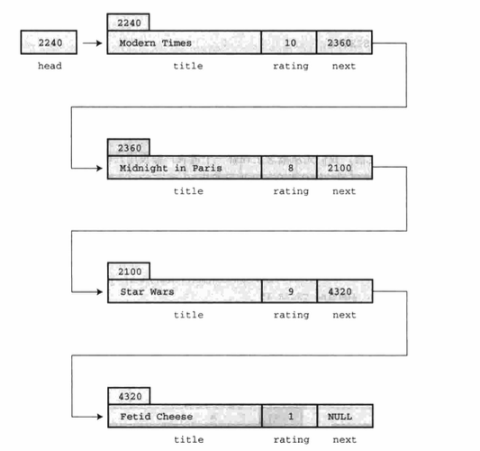

# 高级数据表示

工具是将要的，真正的挑战是设计和创建一个项目。通常程序开发最重要的部分是找到程序中表示数据的好方法。正确地表示数据可以更容易地编写程序其
余部分。找出正确的数据表示不仅仅是选择一种数据类型，还要考虑必须进行哪些操作。也就是说，必须确定如何储存数据，并且为数据类型定义有效的操
作。C 语言为它的基本类型都定义了有效的操作。但是，要设计数据表示的方案时，可能需要自己定义有效操作。简而言之，设计一种数据类型包括设计如
何储存该数据类型和设计一系列管理该数据的函数。

## 链表

假设要编写一个程序，让用户输入一年内看过的所有电影。要储存每部影片的各种信息，如片名、评级等。建议使用一个结构储存每部电影。一个数组储存
所有电影。为简单起见，规定结构中只有两个成员：片名和评级(0～10)。程序如下：

[films1.c](films1.c)

这样设计程序有点问题。首先，浪费许多空间，因为大部分片名都不会超过 40 个字符；其次，电影数量固定的，同时也会浪费内存；另外，一些编译器对
自动存储类别变量（如 movies）可用的内存数量设置了一个默认的限制，大型的数组可能会超过默认设置的值。可以把数组声明为静态或外部数组，或者
设置编译器使用更大的栈来解决这个问题。但是，这样做不能根本解决问题。

该程序真正的问题是，数据表示太不灵活。程序在编译时所需内存量，其实在运行时确定会更好。要解决这个问题，应该使用动态内存分配来表示数据。

理想的情况是，用户可以不确定地添加数据（或者不断添加数据直到用完内存量），而不是先指定要输入多少项，也不用让程序分配多余的空间。

有一种好的方法。

```cpp
#define TSIZE 45  /* 储存片名的数组大小 */
struct film {
    char title[TSIZE];
    int rating;
    struct film *next;
};
```

每个结构中既包含影片信息，也包含指向下一部影片地址的指针。这种定义是定义**链表(linked list)**的基础，链表中的每一项都包含着在何处能找到
下一项的信息。储存第 1 个结构地址的指针被称为**头指针(head pointer)**。链表中的最后一个结构的 next 成员为 NULL。下图即为链表。



从概念上了解了链表，接着就来实现它。

[films2.c](films2.c)

当然，以上程序还有**不足**。它是在特定方法解决特定问题，并且在需要时才添加相关功能的编程方式通常不是最好的解决方案。另一方面，通常都无法
预料程序要完成的所有任务。随着编程项目的越来越大，一个程序员或编程团队事先计划好一切模式，越来越不现实。很多成功的大型程序都是由成功的小
型程序逐步发展而来。

如果要修改程序，首先应该强调最初的设计，并简化其他细节。以上程序并没有遵循这个原则，它把概念模型和代码细节混在一起。例如，该程序的概念模
型是在一个链表中添加项，但是程序却把一些细节（如，malloc() 和 current->next 指针）放在最明显的位置，没有突出接口。如果程序能以某种方
式强调给链表添加项，并隐藏具体的处理细节（如调用内存管理函数和设置指针）会更好。把用户接口和代码细节分开的程序，更容易理解和更新。

## 抽象数据类型(ADT)

在编程时，应该根据编程问题匹配合适的数据类型。在上面的例子中，已经用 C 语言的功能设计了一种符合程序要求的新数据类型。但是，做法并不系统。
现在要用更系统的方法来定义数据类型。

什么是类型？`类型`特指两类信息：属性和操作。

要定义一个新的数据类型。首先，必须提供储存数据的方法；其次，必须提供操控数据的方法。

计算机科学领域已开发了一种定义新类型的好方法，用 3 个步骤完成从抽象到具体的过程。

1. 提供类型属性和相关操作的抽象描述。这些描述既不能依赖特定的实现，也不能依赖特定的编程语言。这种正式的抽象描述被称为**抽象数据类型(ADT)**。

2. 开发一个实现 ADT 的编程接口。也就是说，指明如何储存数据和执行所需操作的函数。例如在 C 中，可以提供结构定义和操控该结构的函数原型。这
些作用于用户定义类型的函数相当于作用于 C 基本类型的内置运算符。需要使用该新类型的程序员可以使用这个接口进行编程。

3. 编写代码实现接口。这一步至关重要，但是使用该新类型的程序员无需了解具体的实现细节。

### 建立抽象

这里采用一种简化的链表作为抽象数据类型。该类型总结如下：

```
类型名:        简单链表
类型属性:      可以储存一系列项
类型操作:      初始化链表为空
              确定链表为空
              确定链表已满
              确定链表中的项数
              在链表末尾添加项
              遍历链表，处理链表中的项
              清空链表
```

### 建立接口

[linkedList.h](LinkedList/linkedList.h)

只有 InitializeList()、AddItem() 和 EmptyTheList() 函数要修改链表，因此从技术角度看，这些函数需要一个指针函数。然而，如果某些函数
接受 List 类型的变量作为参数，而其他函数去取接受 List 类型的地址作为参数，用户会很困惑。因此，为了减轻用户的负担，所有的函数均使用指针
参数。

### 使用接口

目标是：使用这个接口编写程序，但是不必知道具体的实现细节（如，不知道函数的实现细节）。先编写程序的一个伪代码方案。

```
创建一个 List 类型的变量
创建一个 Item 类型的变量
初始化链表为空
当链表未满且有输入时：
    把输入读取到 Item 类型的变量中
    在链表末尾添加项
访问链表中的每个项并显示它们
```

正式程序按照以上伪代码来编写，其中还加入了一些错误检查。该程序还利用了[linkedList.h](LinkedList/linkedList.h)中描述的接口。

[main.c](LinkedList/main.c)

### 实现接口

[linkedList.c](LinkedList/linkedList.c)

## 队列 ADT

在 C 语言中使用抽象数据类型方法编程包含以下 3 个步骤。

1. 以抽象、通用的方式描述一个类型，包括该类型的操作。

2. 设计一个函数接口表示这个新类型。

3. 编写具体代码实现这个接口。

### 定义队列抽象数据类型

**队列(queue)** 是具有两个特殊属性的链表。第一，新项只能添加到链表的末尾；第二，只能从链表的开头移除项。队列是一种"先进先出"(first in, 
first out，缩写 FIFO)的数据形式，就像排队买票的队伍一样（前提是没有人插队）。以下建立一个非正式的抽象定义：

```
类型名:        队列
类型属性:      可以储存一系列项
类型操作:      初始化队列为空
              确定队列为空
              确定队列已满
              确定队列中的项数
              在队列末尾添加项
              在队列开着删除或恢复项
              清空队列
```

### 定义一个接口

[queue.h](queue/queue.h)

### 实现接口函数

[queue.c](queue/queue.c)

### 测试队列

在重要程序中使用一个新的设计（如，队列包）之前，应该先测试该设计。测试的一种方法是，编写一个小程序。这样的程序称为**驱动程序(driver)**，
其唯一的用途是进行测试。

[main.c](queue/main.c)

## 链表和数组

下表总结了链表和数组的性质。

| 数据形式 | 优点 | 缺点 |
| :-- | :-- | :-- |
| 数组 | C 直接支持；提供随机访问 | 在编译时确定大小；插入和删除元素很费时 |
| 链表 | 运行时确定大小；快速插入和删除元素 | 不能随机访问；用户必须提供编程支持 | 

在数组中插入元素，必须移动其他元素腾出空位插入新元素。新插入的元素离数组开头越近，要被移动的元素越多。然而，在链表中插入节点，只需给两个
指针赋值。类似地，从数组中删除一个元素，也要移动许多相关的元素。但是从链表中删除节点，只需重新设置一个指针并释放被删除节点占用的内存即可。

对数组而言，可以使用数组下标直接访问该数组中的任意元素，这叫做**随机访问(random access)**。对链表而言，必须从链表首节点开始，逐个节点
移动到要访问的节点，这叫做**顺序访问(sequential access)**。当然，也可以顺序访问数组。只需按顺序递增数组下标即可。

假设要查找链表中的特定项。一种算法是从列表的开头开始按顺序查找。这叫做**顺序查找(sequential search)**。如果项并未按某种顺序排列，则只
能顺序查找。如果待查找的项不在链表里，必须查找完所有的项才知道该项不在链表中（在这种情况下可以使用并发编程，同时查找列表中的不同部分）。

可以先排序列表，以改进顺序查找。这样就不必查找排在待查找项后面的项。

对于一个排序的列表，用**二分查找(binary search)**比顺序查找好得多。以下分析二分查找的原理。首先，把待查找的项称为**目标项**，而且假设
列表中的各项按字母排序。然后，比较列表的中间项和目标项。如果两者相等，查找结束，如果目标项在中间项后面，则目标项在后半部分项中；如果目标
项在中间项前面，则目标项在前半部分项中。无论哪种情况，两项比较的结果都确定了下次查找的范围只有列表的一半。

用数组实现二分查找很简单，因为可以使用数组下标确定数组中任意部分的中点。但是，链表只支持顺序访问，不提供跳至中间节点的方法。所以在链表中
不能使用二分查找。

如前所述，选择何种数据类型取决于具体的问题。如果因频繁插入和删除项导致经常调整大小，而且不需要经常查找，选择链表会更好。如果只是偶尔插入
或删除项，但是经常进行查找，使用数组会更好。如果需要一种既支持频繁插入和删除项又支持频繁查找的数据形式，数组和链表都无法胜任，怎么办？
这种情况下应该选择二叉查找树。

## 二叉查找树

二叉查找树是一种结合了二分查找策略的链表结构。二叉树的每个节点都包含一个项和两个指向其他节点（称为**子节点**）的指针。下图演示了二叉查找
树中的节点是如何链接的。二叉树中的每个节点都包含两个子节点——左节点和右节点，其顺序按照如下规定确定：左节点的项在父节点的项前面，右节点的
项在父节点的项后面。这种关系存在于每个有子节点的节点中。进一步而言，所有可以追溯其祖先回到一个父节点的左节点的项，都在该父节点项的前面；
所有以一个父节点的右节点为祖先的项，都在该父节点项的后面。该树的顶部被称为**根(root)**。树具有分层组织，所以以这种方式储存的数据也以等级
或层次组织。一般而言，每级都有上一级和下一级。如果二叉树是满的，那么每一级的节点数都是上一级节点数的两倍。

二叉查找树中的每个节点是其后代节点的根，该节点与共后代节点构成了一个**子树(subtree)**。

### 二叉树 ADT

```
类型名:        二叉查找树
类型属性:      二叉树要么是空节点的集合（空树），要么是有一个根节点的节点集合
              每个节点都有两个子树，叫做左子树和右子树
              每个子树本身也是一个二叉树，也有可能是空树
              二叉查找树是一个有序的二叉树，每个节点包含一个项
              左子树的所有项都在根节点项的前面，右子树的所有项都在根节点项的后面
类型操作:      初始化树为空
              确定树是否为空
              确定树是否已满
              确定树中的项数
              在树中添加一个项
              在树中删除一个项
              在树中查找一个项
              在树中访问一个项
              清空树
```

### 二叉查找树接口

原则上，可以用多种方法实现二叉查找树，甚至可以通过操控数组下标用数组来实现。但是，实现二叉查找树最直接的方法是通过指针动态分配链式节点。
因此这样定义：

```
typedef SOMETHING Item;

typedef struct trnode
{
    Item item;
    struct trnode *left;
    struct trnode *right;
} Trn;

typedef struct tree
{
    Trnode *root;
    int size;
} Tree;
```

[tree.h](tree/tree.h)

### 二叉树的实现

接下来，就要实现 [tree.h](tree/tree.h) 中的每个函数。

[tree.c](tree/tree.c)

着重讲解一下以下函数。

#### 添加项

在树中添加一个项，首先要检查该树是否有空间放得下一个项。由于定义二叉树时规定其中的项不能重复，所以接下来要检查树中是否有该项。通过这两步
检查后，便可创建一个新节点，把待添加项拷贝到该节点中，并设置节点的左指针和右指针都为 NULL。然后更新 Tree 结构的 size 成员，统计新增了
一项。接下来，必须找出应该把这个新节点放在树中的哪个位置。如果树为空，则设置根节点指针指向该新节点。否则，遍历树找到合适的位置放置该节点。
