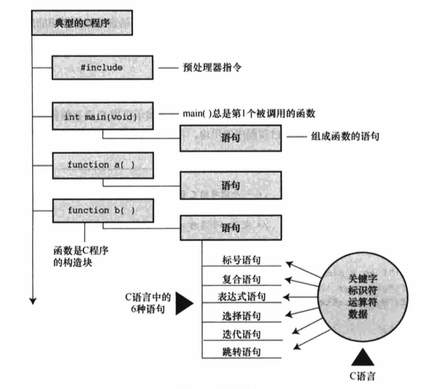

# C 语言概述

## 简单的 C 程序示例

[first.c](first.c)

**程序调整：** 如果程序的输出在屏幕上一闪而过，这是因为某些窗口环境会在单独的窗口运行程序，然后在程序运行结束后自动关闭窗口。如果遇到
这种情况，可以在程序中添加额外的代码，让客串等待用户按下一个键后才关闭。一种方法是，在程序的 return 语句前添加一行代码：

```
getchar();
```

这行代码会让程序等待击键，窗口会在用户按下一个键后才关闭。


## 示例解释

组成 C 程序的几个部分：



### 快速概要

现在简述 [first.c](first.c) 程序中的每行代码的作用。

```
#include <stdio.h>                                                  // <-  包含另一个文件。该行告诉编译器把 stdio.h 中的内容包含在当前程序中
int main(void)                                                      // <-  函数名。圆括号表明 main() 是一个函数名；int 表明 main() 函数返回一个整数。void 表明 main() 不带任何参数
/* 一个简单的 C 程序 */                                               // <-  注释。注释只是为了帮助读者理解程序，编译器会忽略它们
{                                                                   // <-  函数体开始
int num;                                                            // <-  声明。该声明表明，将使用一个名为 num 的变量，而且 num 是 int（整数）类型
num = 1;                                                            // <-  赋值表达式语句。把值 1 赋给名为 num 的变量
printf("I am a simple ");                                           // <-  调用一个函数。
printf("computer.\n");                                              // <-  调用一个函数。
printf("My favorite number is %d because it it first.\n", num);     // <-  调用一个函数。
return 0;                                                           // <-  return 语句。C 函数可以给调用方提供（或返回）一个数。
}                                                                   // <-  结束。
``` 

### 程序细节

1.  \#include 指令和头文件
    
    `#include <stdio.h>`的作用相当于把`stdio.h`文件中的所有内容都输入该行所在的位置。实际上，这是一种"拷贝-粘贴"操作。`include`文
    件提供了一种方便的途径共享许多程序共有的信息。`#include`这行代码是一条**C预处理器指令(preprocessor directive)**。通常，C 编译
    器会在编译前对源代码做一些准备工作，即**预处理(preprocessing)**。通常在 C 程序顶部的信息集合被称为**头文件(header)**。
   
    ```
    注意 为何不内置输入和输出
    
    原因之一，并非所有的程序都会用到 I/O（输入/输出）包。轻装上阵表现了 C 语言的哲学。正是这种经济使用资源的原则，使得 C 语言成为流行
    的嵌入式编程语言。 
    ``` 

2.  main() 函数

    C 程序一定从`main()`函数开始执行（目前不必考虑例外的情况）。圆括号用于识别`main()`是一个函数。除了`main()`函数，可以任意命名其他
    函数。`int`是`main()`函数的返回类型。这表明`main()`函数返回的值是整数。返回到哪里？返回给操作系统。
    
3.  注释

    `/* 一个简单的程序 */`。在程序中，被`/**/`两个符号括起来的部分是程序的注释，该注释可以放在任意的地方，甚至与要解释的内容放在同一行，
    也可以单独一行或多行。C99 新增了另一种风格的注释，普遍用于 C++ 和 Java，使用`//`符号创建，仅限于单行。
    
4.  花括号、函数体和块

    ```{ ... }```。花括号把`main()`函数括起来。一般而言，所有的 C 函数都使用花括号标记函数体的开始和结束，这是规定。花括号还可用于把
    函数中的多条语句合并为一个单元或块。
    
5.  声明

    `int num;`。这行代码叫做**声明(declaration)**。声明是 C 语言最重要的特性之一。在该例中，声明完成了两件事。其一，在函数中有一个名
    为`num`的**变量(variable)**。其二，`int`表明`num`是一个整数。`int`是一种**数据类型**。编译器使用这些信息为`num`变量在内存中分配
    存储空间。
    
    `num`是一个**标识符(identifier)**，也就一个变量、函数或其他实体的名称。因此，声明把特定标识符与计算机内存中的特定位置联系起来，同
    时也确定了储存在某位置的信息类型或数据类型。
    
    在 C 语言中，所有变量都必须先声明才有使用。
    
    * 数据类型：C 语言可以处理多种类型的数据，如整数、字符和浮点数。
    
    * 命名：给变量命名时要使用有意义的变量名或标识符。如果变量名无法清楚地表达自身的用途，可以注释中进一步说明。**这是一种良好的编程习惯和编程
    技巧。C99 和 C11 允许使用更长的标识符名，但是编译器只识别前 63 个字符。对于外部标识符，只允许使用 31 个字符。（以前 C90 只允许 6 个字
    符，旧式编译器通常最多只允许使用 8 个字符。如果使用更长的字符，编译器会忽略超出的字符。
    
    * 声明变量的 4 个理由：方便读者查找和理解程序的用途；促使在编写程序之前做一些计划；有助于发现隐藏在程序中的小错误，如变量名拼写错误；未声
    明变量，C 程序无法通过编译。
    
6.  赋值

    `num = 1;`。