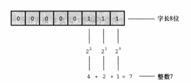

# 数据 和 C

## 示例程序

[platinum.c](platinum.c)

编译后，运行程序：

```
Are you worth your weight int platinum?
let's check it out.
Please enter your weight in pounds: 68
Your weight in platinum is worth $1685829.50.
You are easily worth that! If platinum prices drop, 
eat more to maintain your value.
```

在`Please enter your weight in pounds: `后输入体重，按下 Enter 告诉计算机已完成输入。

```
程序调整
在程序中添加一行代码：getchar();
如果程序的输出在屏幕上一闪而过，则需要调用两次 getchar() 函数：getchar();getchar();
getchar() 函数读取下一个输入字符，因此程序会等待用户输入。在这种情况下，输入 68 并按下 Enter 键，然后 scanf() 读取输入的数字，第 1 个 getchar()
读取换行符，第 2 个 getchar() 让程序暂停，等待输入。
```

### 程序中的新元素

[platinum.c](platinum.c) 包含 C 语言的一些新元素。

* 代码中使用了一种新的变量声明。float 比 int 处理更大范围的数据。float 可以储存带小数的数字。

* 程序中演示了常量的几种新写法。可以使用带小数点的数了。

* 为了打印新类型的变量，在 printf() 中使用`%f`来处理浮点值。`%.2f`中的`.2`用于精确控制输出，指定输出的浮点数只显示小数点后面两位。

* scanf() 用于读取键盘的输入。`%f`说明 scanf() 要读取用户从键盘输入的浮点数，`&weight`告诉 scanf() 把输入的值赋给名为 weight 的变量。scanf() 函
数使用`&`符号表明找到 weight 变量的地点。

* 交互性。计算机向用户询问信息，然后用户输入数字。与非交互式程序相比，交互式程序用起来更有趣，建立了人机双向通信。

## 变量和常量数据

有些数据类型在程序使用之前已经预先设定好了，在整个程序的运行过程中没有变化，这些称为**常量(constant)**。其他数据类型在程序运行期间可能会改变
或被赋值，这些称为**变量(variable)**。

## 数据类型关键字

C 通过识别一些基本的**数据类型**来区分使用不同的数据类型。如果数据是常量，编译器一般通过用户书写的形式来识别类型（如，42 是整数）。但是，对变
量而言，要在声明时指定其类型。C 语言的基本类型关键字，K&R 给出了 7 个与类型相关的关键字。C90 标准添加了 2 个关键字，C99 标准又添加了 3 个关键
字。

| 最初 K&R 给出的关键字 | C90 标准添加的关键字 | C99 标准添加的关键字 |
|:--                  |:--                 |:--                 |
| int                 | signed             | _Bool              |
| long                | void               | _Complex           |
| short               |                    | _Imaginary         |
| unsigned            |                    |                    |
| char                |                    |                    |
| float               |                    |                    |
| double              |                    |                    |

在 C 语言中，用 int 关键字来表示基本的整数类型。后 3 个关键字(long、short 和 unsigned）和 C90 新增的 signed 用于提供基本整数类型的变式，例如 
unsigned short int 和 long long int。char 关键字用于指定字母和其他字符（如，#、$、% 和 *）。另外，char 类型也可以表示较小的整数。float、double、
和 long double 表示带小数点的数。_Bool 类型表示布尔值（true 或 false），_Complex 和 _Imaginary 分别表示复数和虚数。

通过这些关键字创建的类型，按计算机的储存方式可分为两大类型：**整数类型**和**浮点数类型**。

```
位、字节和字

位、字节和字是描述计算机数据单元或存储单元的术语 。这里主要指存储单元。

最小的存储单元是位(bit)，可以储存 0 或 1（或者说，位用于设置"开"或"关"）。虽然 1 位储存的信息有限，但是计算机中位的数量十分庞大。位是计算机内
存的基本构建块。

字节(byte)是常用的计算机存储单位，对于几乎所有的机器，1 字节均为 8 位，这是字节的标准定义，至少在衡量存储单位时是这样，既然 1 位可以表示 0 
或 1，那么 8 位字节就有 256（2 的 8 次方）种可能的 0、1 的组合，通过二进制编码（仅用 0 和 1 便可表示数字），便可表示 0～255 的整数或一组字符。

字(word)是设计计算机时给定的自然存储单位，对于 8 位的微型计虎机，1 个字长只有 8 位。从那以后，个人计算机字长增至 16 位、32 位，直到目前的 64 位，
计算机的字长越大，其数据转移越快，允许的内存访问也更多。
```

### 整数和浮点数

对计算机而言，整数和浮点数的储存方式不同。

### 整数

和数学概念一样，在 C 语言中，**整数**是没有小数部分的数。计算机以二进制数字储存整数，储存整数 7 的方式如下：



### 浮点数

**浮点数**跟数学中的**实数**概念差不多。2.75、3.16E7、7.00 和 2e-8 都是浮点数。注意，在一个值后面加上一个小数点，该值就成为一个浮点值。所以，
7 是整数，7.00 是浮点数。浮点数有多种书写形式，如 e 记数法，3.16E7 表示 3.16*10^7（3.16 乘以 10 的 7 次方）。其中，10^7 = 10000000，7 被称为
10 的**指数**。

关键要理解浮点数和整数的**储存方案不同**。计算机把浮点数分成小数部分和指数部分来表示，而且分开储存这两部分。因此，虽然 7.00 和 7 在数值上相同，
但是它们的储存方式不同。

整数和浮点数两种类型的实际区别。

* 整数没有小数部分，浮点数有小数部分。

* 浮点数可以表示的范围比整数大。

* 对于一些算术运算（如，两个很大的数相减），浮点数损失的精度更多。

* 因为在任何区间内（如，1.0 到 2.0 之间）都存在无穷多个实数，所以计算机的浮点数不能表示区间内所有的值。浮点值通常只是实际值的近似值。

* 过去，浮点运算比整数运算慢。不过，现在许多 CPU 都包含浮点处理器，缩小了速度上的差距。

## C 语言基本数据类型


