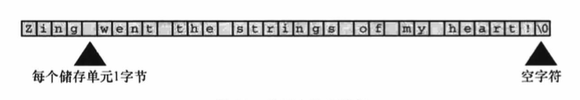

# 字符串和格式化输入/输出

## 前导程序

[talkback.c](talkback.c)

## 字符串简介

**字符串(character string)**是一个或多个字符的序列，如下：

```
"Zing went the strings of my heart!"
```

双引号不是字符串的一部分，仅告知编译器它括起来的是字符串。

### char 类型数组和 null 字符

C 语言没有专门用于储存字符串的变量类型，字符串都被储存在 char 类型的数组中。数组由连续的存储单元组成，字符串中的字符被储存在相邻的存储单元中。



注意上图数组末尾位置的字符`\0`，这是**空字符(null character)**，C 语言用它标记字符串的结束。空字符不是数字 0，它是非打印字符，其 ASCII 码值是
（或等价于）0。C 中的字符串一定以空字符结束，这意味着数组的容量必须至少比待存储字符串中的字符数多 1，因此程序[talkback.c](talkback.c)中有 40 个
存储单元的字符串，只能储存 39 个字符，剩下一个字节留给空字符。

什么是数组？可以把数组看作是一行连续的多个存储单元。用更正式的说法是，数组是同类型数据元素的有序序列。

```
char name[40];
```

name 后面的方括号表明这是一个数组，方括号中的 40 表明该数组中的元素数量。char 表明每个元素的类型。

### 使用字符串

[praise1.c](praise1.c)

不必亲自把空字符放入字符串末尾，scanf() 在读取输入时就已完成这项工作。也不用在**字符串常量** PRAISE 末尾添加空字符。

#### 字符串和字符

字符串常量`"x"`和字符常量`'x'`不同，区别之一在于`'x'`是基本类型(char)，而`"x"`是派生类型(char 数组)，区别之二是`"x"`实际上由两个字符组成：
`'x'`和空字符`\0`。

### strlen() 函数

[praise2.c](praise2.c)

注意，ANSI C 之前的编译器用 strings.h 代替 string.h。

strlen() 得出的结果并未将空字符计入，sizeof 运算符会把末尾的空字符也计算在内。**sizeof**的运算对象是类型时，圆括号必不可少，但是对于特定量，
可有可无，建议所有情况下都使用圆括号。

## 常量和预处理器

常量名比数字表达的信息更多，表达的含义更清楚。另外，如果程序中多处使用一个常量，有时需要改变它的值，使用符号常量，只需要更改符号常量的定义，
不用在程序中查找使用常量的地方。

预处理器可用来定义常量：`definen TAXRATE 0.015`。编译程序时，程序中所有的 TAXRATE 都会被替换成 0.015，这一过程被称为**编译时替换(compile-time substitution)**。
在运行程序时，程序中所有的替换均已完成。通常，这样定义的常量也称为**明示常量(manifest constant)**。

通用格式是：`#define NAME value`。

[pizza.c](pizza.c)

`#define` 指令还可以定义字符和字符串常量。如：

```
#define BEEP '\a'
#define TEE 'T'
#define ESC '\033'
#define OOPS "Now you have done it!"
```

### const 限定符

C90 标准新增了 const 关键字，用于限定一个变量为只读，声明如下：

```
const int MONTHS = 12;
```

const 用起来比`#define` 更灵活。**注意：在 C 语言中，用 const 类型限定符声明的是变量，不是常量。**

### 明示常量

C 头文件 limits.h 和 float.h 分别提供了与整数类型和浮点类型大小限制相关的详细信息。每个头文件都定义了一系列供实现使用的明示常量。如 limits.h 
包含以下类似的代码：

```
#define INT_MAX +32767
#define INT_MIN -32768
```

[defines.c](defines.c)

## printf() 和 scanf() 

printf() 和 scanf() 函数能让用户可以与程序交流，它们是**输入/输出函数**，或简称为`I/O`函数。它们不仅是 C 语言中的`I/O`函数，而且是最多才多艺的
函数。

虽然 printf() 是输出函数，scanf() 是输入函数，但是它们的工作原理几乎相同。

### printf() 函数

请求 printf() 函数打印数据的指令要与待打印数据的类型相匹配。例如，打印整数时使用`%d`。这些符号被称为**转换说明(conversion specification)**。
它们指定了如何把数据转换成可显示的形式。

### 使用 printf()

[printout.c](printout.c)

printf() 函数的格式：

```
printf(格式字符串, 待打印项1, 待打印项2, ...);
```

**格式字符串中的转换说明一定要与后面的每个项相匹配，否则会导致严重后果**：

```
printf("The score was Squids %d, Slugs %d.\n", score1);
```

这里的第 2 个 %d 没有对应任何项，系统不同，导致的结果也不同。

### print() 的转换说明修饰符

在`%`和转换字符之间插入修饰符可修饰基本的转换说明。

[width.c](width.c)

[floats.c](floats.c)

[flags.c](flags.c)
