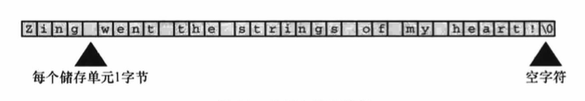

# 字符串和格式化输入/输出

## 前导程序

[talkback.c](talkback.c)

## 字符串简介

**字符串(character string)**是一个或多个字符的序列，如下：

```
"Zing went the strings of my heart!"
```

双引号不是字符串的一部分，仅告知编译器它括起来的是字符串。

### char 类型数组和 null 字符

C 语言没有专门用于储存字符串的变量类型，字符串都被储存在 char 类型的数组中。数组由连续的存储单元组成，字符串中的字符被储存在相邻的存储单元中。



注意上图数组末尾位置的字符`\0`，这是**空字符(null character)**，C 语言用它标记字符串的结束。空字符不是数字 0，它是非打印字符，其 ASCII 码值是
（或等价于）0。C 中的字符串一定以空字符结束，这意味着数组的容量必须至少比待存储字符串中的字符数多 1，因此程序[talkback.c](talkback.c)中有 40 个
存储单元的字符串，只能储存 39 个字符，剩下一个字节留给空字符。

什么是数组？可以把数组看作是一行连续的多个存储单元。用更正式的说法是，数组是同类型数据元素的有序序列。

```
char name[40];
```

name 后面的方括号表明这是一个数组，方括号中的 40 表明该数组中的元素数量。char 表明每个元素的类型。

### 使用字符串

[praise1.c](praise1.c)

不必亲自把空字符放入字符串末尾，scanf() 在读取输入时就已完成这项工作。也不用在**字符串常量** PRAISE 末尾添加空字符。

#### 字符串和字符

字符串常量`"x"`和字符常量`'x'`不同，区别之一在于`'x'`是基本类型(char)，而`"x"`是派生类型(char 数组)，区别之二是`"x"`实际上由两个字符组成：
`'x'`和空字符`\0`。

### strlen() 函数

[praise2.c](praise2.c)

注意，ANSI C 之前的编译器用 strings.h 代替 string.h。

strlen() 得出的结果并未将空字符计入，sizeof 运算符会把末尾的空字符也计算在内。**sizeof**的运算对象是类型时，圆括号必不可少，但是对于特定量，
可有可无，建议所有情况下都使用圆括号。

## 常量和预处理器

常量名比数字表达的信息更多，表达的含义更清楚。另外，如果程序中多处使用一个常量，有时需要改变它的值，使用符号常量，只需要更改符号常量的定义，
不用在程序中查找使用常量的地方。

预处理器可用来定义常量：`definen TAXRATE 0.015`。编译程序时，程序中所有的 TAXRATE 都会被替换成 0.015，这一过程被称为**编译时替换(compile-time substitution)**。
在运行程序时，程序中所有的替换均已完成。通常，这样定义的常量也称为**明示常量(manifest constant)**。

通用格式是：`#define NAME value`。

[pizza.c](pizza.c)

`#define` 指令还可以定义字符和字符串常量。如：

```
#define BEEP '\a'
#define TEE 'T'
#define ESC '\033'
#define OOPS "Now you have done it!"
```

### const 限定符

C90 标准新增了 const 关键字，用于限定一个变量为只读，声明如下：

```
const int MONTHS = 12;
```

const 用起来比`#define` 更灵活。**注意：在 C 语言中，用 const 类型限定符声明的是变量，不是常量。**

### 明示常量

C 头文件 limits.h 和 float.h 分别提供了与整数类型和浮点类型大小限制相关的详细信息。每个头文件都定义了一系列供实现使用的明示常量。如 limits.h 
包含以下类似的代码：

```
#define INT_MAX +32767
#define INT_MIN -32768
```

[defines.c](defines.c)

## printf() 和 scanf() 

printf() 和 scanf() 函数能让用户可以与程序交流，它们是**输入/输出函数**，或简称为`I/O`函数。它们不仅是 C 语言中的`I/O`函数，而且是最多才多艺的
函数。

虽然 printf() 是输出函数，scanf() 是输入函数，但是它们的工作原理几乎相同。

### printf() 函数

请求 printf() 函数打印数据的指令要与待打印数据的类型相匹配。例如，打印整数时使用`%d`。这些符号被称为**转换说明(conversion specification)**。
它们指定了如何把数据转换成可显示的形式。

### 使用 printf()

[printout.c](printout.c)

printf() 函数的格式：

```
printf(格式字符串, 待打印项1, 待打印项2, ...);
```

**格式字符串中的转换说明一定要与后面的每个项相匹配，否则会导致严重后果**：

```
printf("The score was Squids %d, Slugs %d.\n", score1);
```

这里的第 2 个 %d 没有对应任何项，系统不同，导致的结果也不同。

### print() 的转换说明修饰符

在`%`和转换字符之间插入修饰符可修饰基本的转换说明。

[width.c](width.c)

[floats.c](floats.c)

[flags.c](flags.c)

[stringf.c](stringf.c)

### 转换说明的意义

转换说明把以二进制格式储存在计算机中的值转换成一系列字符（字符串）以便于显示。转换说明是翻译说明。

#### 转换不匹配

[intconv.c](intconv.c)

[floatcnv.c](floatcnv.c)

#### printf() 的返回值

printf() 返回打印字符的个数。如果有输出错误，printf() 则返回一个负值(printf())的旧版本会返回不同的值。

[prntval.c](prntval.c)

#### 打印较长的字符串

[longstrg.c](longstrg.c)

* 方法1：使用多个 printf() 语句；

* 方法2：用反斜杠`\`和Enter（或 Return）键组合来断行。如果不希望多出其余字符，下一行必须从最左边开始，否则都会成为字符串的一部分；

* 方法3：ANSI C 引入的字符串连接。在两个用双引号括起来的字符串之间用空白隔开，C 编译器会把多个字符串看作是一个字符串；

### 使用 scanf()

scanf() 可以读取不同格式的数据。scanf() 把输入的字符串转换成整数、浮点数、字符或字符串。scanf() 和 printf() 类似，也使用格式字符串和参数列表。
两个函数主要的区别在参数列表中，printf() 使用变量、常量和表达式，而 scanf() 使用指向变量的指针。

* scanf() 读取基本变量类型的值，在变量名前加上一个 &；

* 如果用 scanf() 把字符串读入字符数组中，不要使用 &；

[input.c](input.c)

scanf() 使用空白（换行符、制表符和空格）把输入分成多个字段。**唯一例外的是 %c 转换说明**。根据`%c`，scanf() 会读取每个字符，包括空白。

#### 从 scanf() 角度看输入

假设 scanf() 根据一个`%d`转换说明读取一个整数。scanf() 每次读取一个字符，跳过所有的空白字符，直到遇到第 1 个非空白字符才开始读取。如果找到一个
数字或符号(+ 或 -)，它便保存该字符，并读取下一个字符。如果下一个字符是数字，它便保存该数字并读取下一个字符。如此不断地读取和保存字符，直到遇到
非数字字符。如果遇到一个非数字字符，它便认为读取了整数的末尾。然后，scanf() 把非数字字符放回输入。这意味着程序在下一次读取输入时，首先读取的是
上一次读取丢弃的非数字字符。最后，scanf() 计算已读取数字（可能还有符号）相应的数值，并将计算后的值放入指定的变量中。

如果第 1 个非空白字符是 A 而不是数字，scanf() 将停在那里，并把 A 放回输入中，不会把值赋给指定变量。程序在下一次读取输入时，首先读到的字符是 A。
如果程序只使用 %d 转换说明，scanf() 就一直无法越过 A 读下一个字符。另外，如果使用带多个转换说明的 scanf()，C 规定在第 1 个出错处停止读取输入。
(**貌似不对，使用 Apple LLVM version 7.0.0 (clang-700.1.74) 编译器，%d 转换字符，出现很奇怪的数字**)

**使用 %s 转换说明，scanf() 会读取除空白字符以外的所有字符，跳过空白开始读取第 1 个非空白符，并保存非空白字符直到再次遇到空白。当 scanf() 把
字符串放进指定数组中时，会在字符序列的末尾加上`'\0'`，让数组中的内容成为一个 C 字符串**。

#### 格式字符串中的普通字符

scanf() 允许把普通字符放在格式字符串中。除空格字符外的普通字符必须与输入字符串严格匹配。如：

```
scanf("%d,%d", &n, &m);
```

scanf() 将其解释成：用户将输入一个数字、一个逗号，然后再输入一个数字。也就是说，用户必须如下输入：

```
88,121
```

由于格式字符串中，`%d`后紧跟逗号，所有必须在输入 88 后输入一个逗号。但是，由于 scanf() 会跳过整数前面的空白，所以以下两种输入方式都可以：

```
88, 121

88,
121
```

格式字符串中的空白意味着跳过下一个输入项前面的所有空白。如：

```
scanf("%d ,%d", &n, &m);
```

以下的输入格式都没问题：

```
88,121

88 ,121
88 , 121
```

**所有空白**的概念包括没有空格的特殊情况。除了`%c`，其他转换说明都会自动跳过待输入值前面所有的空白。

#### scanf() 的返回值

scanf() 返回成功读取的项数。如果没有读取任何项，且需要读取一个数字而用户却输入一个非数值字符串，scanf() 便返回 0。当 scanf() 检测到"文件结尾”
时，会返回 EOF。

### printf() 和 scanf() 的 * 修饰符

[varwid.c](varwid.c)

[skip2.c](skip2.c)

### printf() 的用法提示
